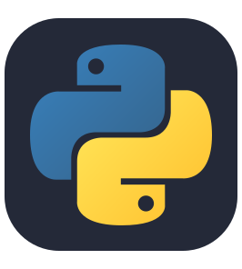
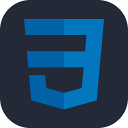
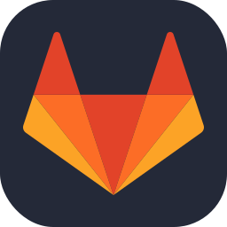

<!-- prettier-ignore. extra Lanyard code if wanted: &waveColor=7289DA&waveSpotifyColor=7289DA 
<kbd> | <a href="https://matias.ma/nsfw/"><b>Trust Me</b></a> |  </kbd>
-->

 <kbd> | <b>Howdy</b> |  </kbd>
 &nbsp;
 <kbd> | <b>Jonny / 25 / LDN</b> |  </kbd>
  &nbsp;
 <kbd> | <a href="https://www.linkedin.com/in/jonnyrodrigues/"><b>LinkedIn</b></a> |  </kbd>
 &nbsp;
 <kbd> | <a href="https://kitsu.io/users/ojijonny/library"><b>Anime List</b></a> |  </kbd>
 &nbsp;
 <kbd> | <a href="https://matias.ma/nsfw/"><b>Trust Me</b></a> |  </kbd>

 

  <table>
  <thead>
   <tr>
      <th width="550px">
       
    </th>
      <th width="550px">
       
    </th>
    </tr> 
  </thead>
 </table>
 
<table>
  <tbody>
   <tr width="600px">
    <td width="1100px">
     <b>Languages</b>
     
      

        
        
        
        
        
        
        
        
      

     <b>Tools</b>
     

        
        
        
        
        
        
        
        
        
        
     

  </td>
 </tr>

</tbody>
</table>

